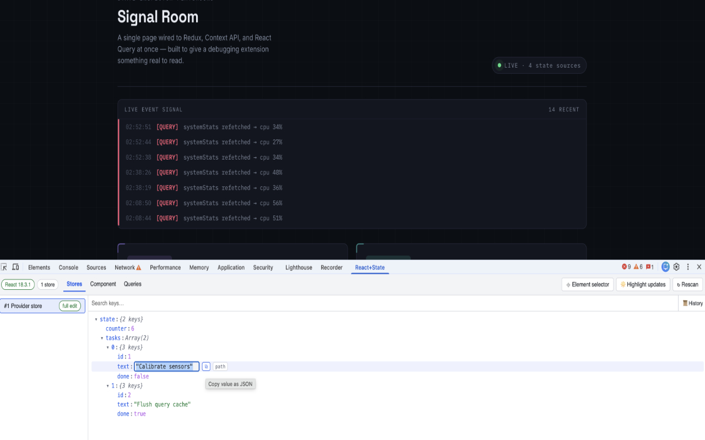

# React + State Inspector

A Chrome DevTools extension for debugging React apps — with first-class support for
**Redux** and **React Query** — that lets you see and *edit* your app's state live.

> **[Install from the Chrome Web Store](TODO(cws-url))**

## Features

- **See every Redux store on the page.** Live, expandable state trees for every
  discovered store — including apps built with Redux Toolkit (`configureStore`).
- **Edit state on the fly.** Double-click any value in the state tree to change it and
  watch your app update.
- **Visual component picker.** Click "Pick component", hover to see components
  highlighted by name, then click to inspect props, state, and hooks. Class component
  state is editable.
- **React Query support.** Detects `@tanstack/react-query` (v4/v5) `QueryClient`
  instances. Inspect queries and mutations live, edit query data, and
  refetch/invalidate/reset/remove individual queries.
- **Works with React 15 and newer.** Fibers (React 16+) and legacy internal instances
  (React 15) are both supported.
- **Plays nicely with the official React & Redux DevTools.** If they're installed, this
  extension chains through them instead of fighting them.

## How to use it

1. Install from the [Chrome Web Store](TODO(cws-url)).
2. Open **Chrome DevTools** on any React page.
3. Switch to the **React + State** panel.
4. Explore the **Stores**, **Component**, and **Queries** tabs. Double-click values to
   edit; click "Pick component" to select a component from the page.

Nothing needs to be added to your app — no wrappers, no imports, no build config
changes. The extension detects React and its ecosystem on its own.

## Privacy policy

This extension does not collect, transmit, or store any user data off-device.

- **No network calls.** No `fetch`, `XMLHttpRequest`, or similar requests to any
  server. No backend, no analytics, no telemetry, no crash reporting.
- **No persistent storage.** No `chrome.storage`, cookies, or `localStorage` are used
  by the extension. Nothing survives closing DevTools.
- **Local only.** All inspection happens between the inspected tab, the extension's
  own background service worker, and the DevTools panel — all running on your machine.
  Nothing is sent to the extension author or any third party.
- **Why does it request `<all_urls>`?** The extension is a DevTools panel: it needs to
  be able to inject its page agent into whichever page you open DevTools on —
  localhost, staging, production, internal tools. The page agent only runs on tabs
  where you have DevTools open, and it reads React/Redux/React Query state exclusively
  to display it in the panel.

## Limitations

- Hook values are read-only. React offers no supported way to set them from outside;
  class component state is editable.
- Stores that aren't created through the Redux DevTools enhancer get "ephemeral" edits
  — the store and the panel see the edited state and the app repaints, but the next
  real dispatched action recomputes state from the store's own reducer and the edit is
  discarded. The panel labels these stores "ephemeral edit".
- On apps using **react-redux v8+**, ephemeral edits may not repaint immediately
  (`useSyncExternalStore` captures the pre-patch `getState`); the app picks up the
  change on its next render. react-redux ≤7, `connect()`, and manual subscribers
  repaint immediately.
- Values that aren't plain JSON (functions, Maps, class instances…) are shown but not
  editable as a whole.

## Report an issue

Bug reports, feature requests, and questions:
[open an issue](https://github.com/tom31415/react-state-chrome-extension/issues).

## Development

Contributing, building from source, testing, and architecture notes live in
[`docs/DEVELOPMENT.md`](docs/DEVELOPMENT.md).
